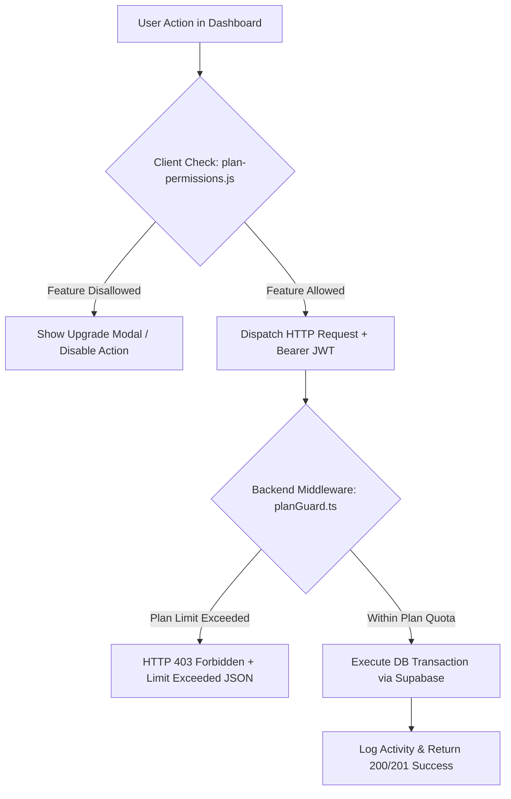
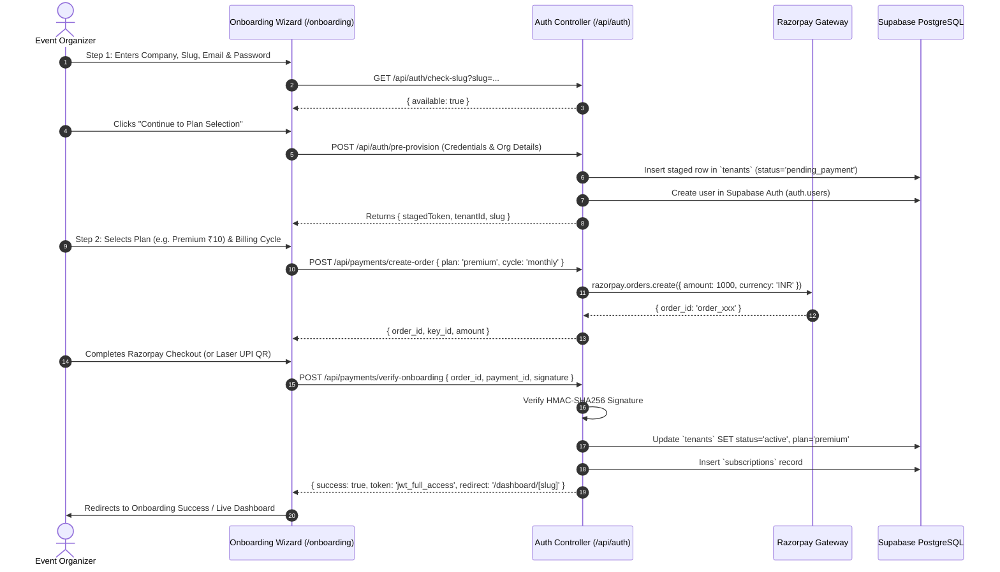
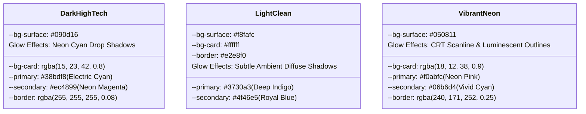
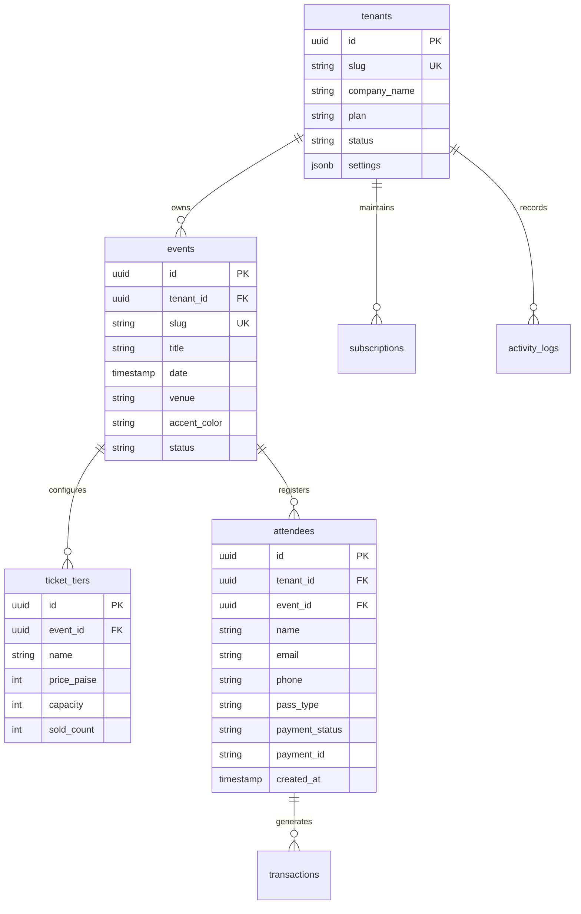

# Platform Feature Reference & Architecture Specification

**Document Version:** 2.0.0  
**Target Environment:** Production (Netlify CDN, Supabase PostgreSQL, Node.js/Express Backend on GCP Cloud Run)  
**Classification:** Senior Technical Product Architecture & System Specification  
**Status:** Active / Production-Ready  

---

## Table of Contents

1. [Executive Summary & High-Level System Architecture](#1-executive-summary--high-level-system-architecture)
2. [Subscription Plan Feature Gating & Tier Matrix](#2-subscription-plan-feature-gating--tier-matrix)
3. [Pre-Payment Account Provisioning & Password Registration](#3-pre-payment-account-provisioning--password-registration)
4. [Unified Dashboard Theme Customization & State Persistence](#4-unified-dashboard-theme-customization--state-persistence)
5. [Automated Flyer-to-Form Generation & Public Hosting (`/register/[event-slug]`)](#5-automated-flyer-to-form-generation--public-hosting)
6. [Real-Time Attendee Database & Events Hub Supabase Sync](#6-real-time-attendee-database--events-hub-supabase-sync)
7. [Netlify Root Routing & CDN Architecture](#7-netlify-root-routing--cdn-architecture)
8. [Security, Row-Level Security (RLS) & Multi-Tenant Isolation](#8-security-row-level-security-rls--multi-tenant-isolation)

---

## 1. Executive Summary & High-Level System Architecture

The **EventReg Platform** (by EventReg Platform Technology LLP) is a high-concurrency, multi-tenant Software-as-a-Service (SaaS) platform engineered for event organizers, enterprise summits, and MSMEs. The platform empowers organizers to provision branded event workspaces, generate dynamic marketing flyers, publish high-converting registration funnels, accept instantaneous payments via Razorpay, and monitor real-time attendee telemetry.

### 1.1 Architecture Topology

```
+-----------------------------------------------------------------------------------+
|                                  CLIENT LAYER                                     |
|                                                                                   |
|  [ Netlify Global CDN Edge ]  --->  SaaS Landing Page (/landing/index.html)        |
|  [ Custom Tenant Domains ]   --->  Hosted Registration (/register/[event-slug])  |
|  [ Organizer Portal ]        --->  Unified Dashboard (/dashboard/[slug])         |
+------------------------------------------+----------------------------------------+
                                           |
                                           v
+-----------------------------------------------------------------------------------+
|                              API & COMPUTE LAYER                                  |
|                                                                                   |
|  [ Express / TypeScript Backend (GCP Cloud Run / Node.js ES Modules) ]            |
|    - Auth & Provisioning Controller (/api/auth, /api/provision)                   |
|    - Subscription & Plan Gating Engine (/api/subscription, /api/t/:slug/plans)    |
|    - Dynamic Event & Flyer Routing (/api/public/events, /api/t/:slug/flyers)      |
|    - Razorpay Webhook & Order Engine (/api/payments, /api/t/:slug/checkout)       |
+------------------------------------------+----------------------------------------+
                                           |
                                           v
+-----------------------------------------------------------------------------------+
|                             DATA & PERSISTENCE LAYER                              |
|                                                                                   |
|  [ Supabase (PostgreSQL 15) ]                                                     |
|    - Row-Level Security (RLS) Multi-Tenant Enforced Tables                        |
|    - Supabase Realtime Engine (WebSocket Event Bus: public:attendees)             |
|    - Supabase Storage (Public CDN Buckets: `flyers`, `logos`, `avatars`)          |
+-----------------------------------------------------------------------------------+
```

---

## 2. Subscription Plan Feature Gating & Tier Matrix

The platform implements an automated, multi-tiered subscription matrix designed for low-friction onboarding, high conversion, and rigid feature entitlement enforcement.

### 2.1 Subscription Tier Matrix & Limits

| Plan Tier | Monthly Price | Yearly Price (17% Off) | Concurrent Events | Max Attendees / Mo | Dynamic AI Flyer Studio | Advanced Analytics & CSV Export | Custom Domain & API Access | Support SLA |
| :--- | :--- | :--- | :--- | :--- | :--- | :--- | :--- | :--- |
| **Basic** | **₹1 / month** | ₹10 / year | **3 Events** | 500 Attendees | ❌ Locked | ❌ Basic Counts Only | ❌ Subpath Only | Standard (48h SLA) |
| **Standard** | **₹5 / month** | ₹50 / year | **10 Events** | 5,000 Attendees | ❌ Locked | ✅ Full Analytics + CSV/Excel | ❌ Subpath Only | Priority (24h SLA) |
| **Premium** | **₹10 / month** | ₹100 / year | **50 Events** | 25,000 Attendees | ✅ Unlocked (All Templates) | ✅ Advanced Analytics + Heatmaps | ✅ White-Label + API | VIP Concierge (4h SLA) |

> [!NOTE]
> All currency amounts are represented internally in **paise** (1 INR = 100 paise) across Razorpay order creation, database records, and backend accounting modules to prevent floating-point rounding errors.

### 2.2 Dual-Layer Feature Gating Implementation

To ensure airtight security and an intuitive UX, feature gating is enforced across both frontend client controllers and backend API middleware.



#### A. Frontend Enforcement (`frontend/dashboard/js/plan-permissions.js`)
The client module initializes a frozen permission lookup table (`TIER_PERMISSIONS`). On dashboard load, the active plan is parsed from `DashboardAuth.getTenant().plan`:
- **Event Creation Thresholds**: When an organizer attempts to add a new event in `events.js`, the system counts existing active events against `tier.eventsLimit`. If equal or greater, the "Create Event" modal is blocked, and an upgrade prompt is rendered.
- **AI Flyer Generator Gating**: In `flyer-generation.js`, if `tier.aiFlyerGeneration === false`, accessing the AI Flyer tab renders a high-tech glassmorphism locked state explaining that AI Dynamic Flyers require the **Premium (₹10/mo)** tier.
- **CSV & Excel Exports**: In `events.js` and `analytics.js`, export buttons are conditionally disabled or bound to the upgrade dialog for Basic tier accounts.

#### B. Backend Enforcement (`backend/src/middleware/planGuard.ts` & Services)
Every mutating endpoint performs server-side entitlement checks:
```typescript
// Example: Verifying Event Creation Quota
export async function enforceEventLimit(tenantId: string, planName: string): Promise<void> {
    const limits = PLAN_LIMITS[planName.toLowerCase()] || PLAN_LIMITS.basic;
    const { count, error } = await supabaseAdmin
        .from('events')
        .select('*', { count: 'exact', head: true })
        .eq('tenant_id', tenantId)
        .eq('status', 'active');

    if (error) throw new DatabaseError('Failed to query event counts');
    if ((count ?? 0) >= limits.eventsLimit) {
        throw new PlanLimitExceededError(`Plan limit reached. Your plan allows max ${limits.eventsLimit} active events.`);
    }
}
```

---

## 3. Pre-Payment Account Provisioning & Password Registration

To maximize funnel conversion while preventing orphan accounts and database clutter, the platform executes a **Staged Pre-Payment Provisioning Workflow**.



### 3.1 Key Architectural Highlights of Pre-Provisioning

1. **Pre-Payment Credential Security**: Passwords are encrypted and managed directly via Supabase Auth bcrypt hashing algorithms. At no point are raw passwords stored in application logs or tenant metadata.
2. **Session Guard & Recovery (`checkExistingSession()`)**:
   - If an organizer drops off after Step 1 but before completing payment, visiting `/onboarding` automatically detects their pending session token and jumps them straight to **Step 2 (Plan Selection / Payment Retry)** without forcing re-entry of company details.
   - If an account is already verified and paid, the session guard redirects immediately to `/dashboard/[slug]`.
3. **Automated Idempotency**: Staged tenant rows use unique constraints on `slug` and `email`. Re-submitting Step 1 updates existing staged records rather than generating duplicate database entries.

---

## 4. Unified Dashboard Theme Customization & State Persistence

The Organizer Dashboard features a centralized, design-token-driven theming architecture supporting three distinct visual presentations.

### 4.1 Theme Design Token Specifications



### 4.2 Tri-Tier State Persistence Pipeline

To deliver an instantaneous, zero-latency interface with zero Flash of Unstyled Content (FOUC), theme state is persisted across three synchronized layers:

1. **DOM Execution Layer (`data-theme` Attribute)**:
   - Dynamic theme switching executes `document.documentElement.setAttribute('data-theme', themeName)`.
   - A global transition hook `.theme-transitioning` is temporarily appended to `<html>` for 200ms to guarantee smooth CSS color morphing across all child components.
2. **Local Storage Immediate Cache (`localStorage.getItem('dashboard_theme')`)**:
   - Evaluated synchronously in `<head>` before HTML parsing begins, eliminating white flashes during page reloads.
3. **Cloud Profile Synchronization (`Supabase DB`)**:
   - When modified inside Settings (`settings.js`), an asynchronous background patch (`PATCH /api/t/:slug/settings`) commits `{ settings: { theme: themeName } }` to the tenant record in Supabase, preserving theme selection across different workstations and mobile browsers.

---

## 5. Automated Flyer-to-Form Generation & Public Hosting

The platform bridges marketing generation and public conversion through an integrated **5-Step Progressive AI Flyer Studio** and dynamic public registration routing (`/register/[event-slug]`).

### 5.1 5-Step Progressive Studio Architecture (`flyer-generation.js`)

```
+---------------------------------------------------------------------------------------+
|                                AI FLYER STUDIO PIPELINE                               |
+-------------------+-------------------+-------------------+-------------------+-------+
|  Step 1: Identity |  Step 2: Logistics|  Step 3: Speakers |  Step 4: Agenda   | Step 5|
|  - Event Title    |  - Date & Time    |  - Dynamic Cards  |  - Time-slot rows | Preview|
|  - Category Badge |  - Venue/Online   |  - Avatar URLs    |  - Value Perks    | & JSON|
|  - Accent Color   |  - Timezone       |  - VIP Badges     |  - Key Takeaways  | Export|
+-------------------+-------------------+-------------------+-------------------+-------+
                                        |
                                        v
               [ Live Reactive HTML5 Canvas Preview & DOM Engine ]
                                        |
                 +----------------------+----------------------+
                 |                                             |
                 v                                             v
     [ Export: High-Res PNG / PDF ]               [ Publish to Public Form API ]
```

### 5.2 Dynamic Public Hosting Engine (`/register/[event-slug]`)

When an event is published, it is instantly accessible to attendees via `https://<domain>/register/[event-slug]` (or `register.html?event=[event-slug]`).

#### Public Registration Lifecycle (`frontend/js/register.js`):
1. **Slug Resolution**: Parses `:eventSlug` from pathname or search parameter `?event=slug`.
2. **Metadata Hydration**: Executes `GET /api/public/events/:eventSlug`, populating:
   - Dynamic `--event-accent` CSS variables based on organizer configuration.
   - Verified organizer badge, company logo, and custom event hero banner.
   - Dynamic Speaker Roster with fallback avatar handling.
   - Structured Agenda Timeline and Key Perks items.
3. **Multi-Tier Ticket Selection**: Attendees choose between configured tiers (e.g. VIP Pass, General Access, Early Bird).
4. **Embedded Razorpay Checkout**:
   - Submitting the form calls `POST /api/public/events/:eventSlug/register`.
   - Opens Razorpay modal directly within the registration page.
   - On payment verification, transitions the DOM into a confirmed state displaying a generated **Registration ID & QR Access Pass**.

---

## 6. Real-Time Attendee Database & Events Hub Supabase Sync

The Events Hub and Attendee Database modules deliver real-time operational telemetry for organizers handling high-volume summits.

### 6.1 Database Schema & Entity Relationships



### 6.2 Real-Time WebSocket Telemetry (`events.js`)

- **Supabase Realtime Channel**: On dashboard mount, a live channel subscription is established:
  ```javascript
  const attendeeChannel = supabaseClient
      .channel(`tenant-attendees-${tenantId}`)
      .on('postgres_changes', {
          event: 'INSERT',
          schema: 'public',
          table: 'attendees',
          filter: `tenant_id=eq.${tenantId}`
      }, (payload) => {
          handleIncomingAttendee(payload.new);
      })
      .subscribe();
  ```
- **Optimistic Metric Increments**: Incoming attendee events immediately increment "Live Seats Left", "Total Attendees", and "Revenue Today" KPI widgets with flash-highlight animations without triggering a full table redraw.
- **Data Export Utilities**: Real-time attendee records can be instantly exported client-side to formatted `.csv` or `.xlsx` sheets with dynamic column mapping and timestamp sanitization.

---

## 7. Netlify Root Routing & CDN Architecture

To ensure the root domain serves the product marketing landing page rather than nested or internal event preview pages, the deployment topology utilizes edge-level rewrites and client-side fallback redirects.

```
Incoming Request: https://domain.com/
           |
           v
+-------------------------------------------------------------+
| Netlify Edge Routing Engine (netlify.toml)                   |
| Rule: [[redirects]] from="/" to="/landing/index.html" 200   |
+-------------------------------------------------------------+
           |
           |---> [Status 200 OK: Serves /landing/index.html Directly]
           |
           v
(In case of static direct index request: /index.html)
+-------------------------------------------------------------+
| Fallback Redirect Page (frontend/index.html)                |
|  1. JS: window.location.replace('./landing/index.html')     |
|  2. Meta: <meta http-equiv="refresh" content="0; ...">     |
+-------------------------------------------------------------+
           |
           v
[ Instant Client-Side Redirection to SaaS Landing Page ]
```

---

## 8. Security, Row-Level Security (RLS) & Multi-Tenant Isolation

1. **Row-Level Security (RLS)**: Enforced across all tenant tables in Supabase. Every query executed with user JWTs is automatically scoped by PostgreSQL policies matching `auth.uid() = user_id` and `tenant_id = current_tenant_id()`.
2. **Super-Admin Service Role Isolation**: Super-admin actions utilize elevated backend service keys strictly guarded behind IP filtering and JWT verification.
3. **Cross-Tenant Guard Middleware**: Backend routes validate `:slug` against the decoded JWT claims, rejecting cross-tenant parameter tampering with `403 Forbidden`.
